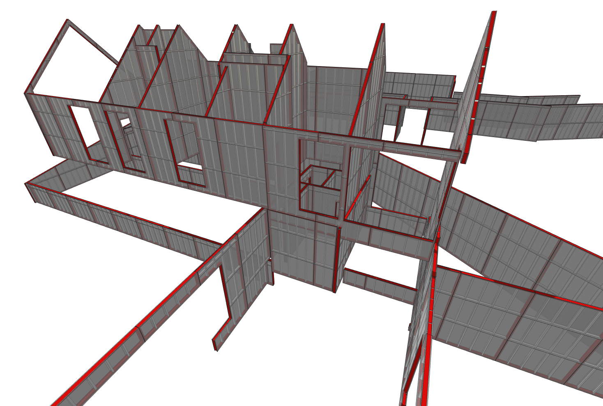

            
# Prefabricated Panels

This function creates pre-fabricated wall panels from WallPanels.

|Input Name|Type|Description|
|---|---|---|
|Stud Spacing|Range|The spacing of the studs on center.|
|Create Wall Board|Boolean|Should wall board be generated?|

 

|Output Name|Type|Description|
|---|---|---|
|Total Panels|Number|The total number of panels generated.|
|Total Length of Framing|Number|The total length of framing generated.|

